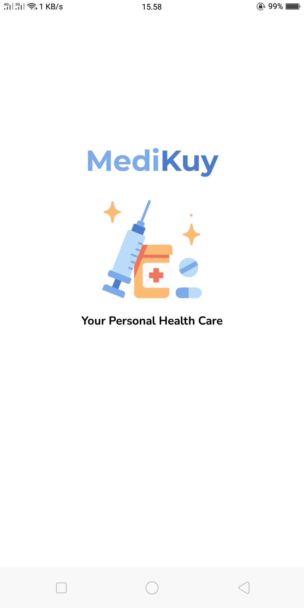

<div id="top"></div>

[![Contributors][contributors-shield]][contributors-url]

<br>
<div align="center">
  <a href="https://github.com/Rakamin-Bootcamp-Kelompok-1/alodokter-rakamin-android-kelompok1">
    
  </a>
  <p align="center">
    <a href="https://github.com/Rakamin-Bootcamp-Kelompok-1/alodokter-rakamin-android-kelompok1">
		  <h3 align="center">Medikuy</h1>
    </a>
  </p>
</div>

<details>
  <summary>Table of Contents</summary>
  <ol>
    <li>
      <a href="#about-the-project">About The Project</a>
      <ul>
        <li><a href="#built-with">Built With</a></li>
      </ul>
    </li>
    <li>
      <a href="#getting-started">Getting Started</a>
      <ul>
        <li><a href="#prerequisites">Prerequisites</a></li>
        <li><a href="#installation">Installation</a></li>
      </ul>
    </li>
    <li><a href="#screenshot">Screenshot</a></li>
    <li><a href="#creator">Creator</a></li>
  </ol>
</details>

## About The Project
<span align="center">
 <hr>
 <p>
    
    
    
 </p>
 <p align="center">Medikuy Screenshot</p>
</span>
<p align="justify">
  &emsp;&emsp;&emsp;&emsp;Medikuy merupakan portofolio aplikasi yang dibuat untuk menyelesaikan bootcamp Android Developer yang diselenggarakan oleh Rakamin dan Alodokter. 
  Aplikasi ini dapat membaca artikel kesehatan, dan membuat janji dengan dokter(on progress).
</p>
<p align="right">(<a href="#top">back to top</a>)</p>

### Built With

* [Glide](https://github.com/bumptech/glide)
* [CircleImageView](https://github.com/hdodenhof/CircleImageView)
* [Bcrypt](https://github.com/patrickfav/bcrypt)
* [Material UI](https://material.io/)
* [Gson](https://github.com/google/gson)
* [Retrofit](https://square.github.io/retrofit/)
* [Android Jetpack Navigation](https://developer.android.com/guide/navigation)
* [DataBinding](https://developer.android.com/topic/libraries/data-binding)
* MVVM Architecture Pattern
<p align="right">(<a href="#top">back to top</a>)</p>

## Getting Started

### Prerequisites

* Gradle version 7.0.1
* Kotlin version 1.6.0
* Minimum Android SDK API Level 25

### Installation

1. Clone the repo
   ```sh
   git clone https://github.com/Rakamin-Bootcamp-Kelompok-1/alodokter-rakamin-android-kelompok1.git
   ```
2. Build Project

<p align="right">(<a href="#top">back to top</a>)</p>

## Screenshot

<table align="center">
  <tr>
    <td align="center">OnBoarding Screen</td>
    <td align="center">Splash Screen</td>
    <td align="center">Home Screen</td>
  </tr>
  <tr>
    <td></td>
    <td></td>
    <td></td>
  </tr>
  <tr>
    <td align="center">Register Screen</td>
    <td align="center">Login Screen</td>
    <td align="center">Forgot Password Screen</td>
  </tr>
  <tr>
    <td></td>
    <td></td>
    <td></td>
  </tr>
  <tr>
    <td align="center">History Booking Screen</td>
    <td align="center">List Article Screen</td>
    <td align="center">List Doctor Screen</td>
  </tr>
  <tr>
    <td></td>
    <td></td>
    <td></td>
  </tr>
  <tr>
    <td align="center">Detail Doctor Screen</td>
    <td align="center">Detail Article Screen</td>
    <td align="center">Confirmation Booking Screen</td>
  </tr>
  <tr>
    <td></td>
    <td></td>
    <td></td>
  </tr>
  <tr>
    <td align="center">Edit Profile Screen</td>
    <td align="center">My Profile Screen</td>
    <td align="center">Change Password Screen</td>
  </tr>
  <tr>
    <td></td>
    <td></td>
    <td></td>
  </tr>  
  <tr>
    <td align="center" colspan="3">Success Booking Screen</td>
  </tr>
  <tr>
    <td align="center" colspan="3"></td>
  </tr>  
</table>

<p align="right">(<a href="#top">back to top</a>)</p>

## Creator
Aplikasi Android Medikuy dibuat oleh:
* [Faikar Azman Rasyid](https://github.com/Faykar)
* [Russi Hersiano](https://github.com/Her-Droid)
* [Bayu Novaldi](https://github.com/idlavoNuyaB)
* [Palambas Sinaga](https://github.com/PalambasSinaga)

<p align="right">(<a href="#top">back to top</a>)</p>

<!-- MARKDOWN LINKS & IMAGES -->
[contributors-shield]: https://img.shields.io/github/contributors/Rakamin-Bootcamp-Kelompok-1/alodokter-rakamin-android-kelompok1.svg?style=for-the-badge
[contributors-url]: https://github.com/Rakamin-Bootcamp-Kelompok-1/alodokter-rakamin-android-kelompok1/graphs/contributors
